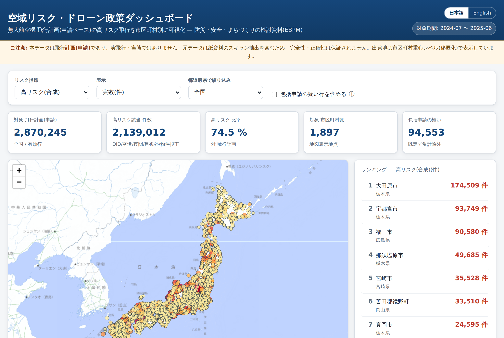

# 空域リスク・ドローン政策ダッシュボード

無人航空機（ドローン）の**飛行計画データ**をもとに、**リスクの高い飛行**（人口集中地区・空港周辺・夜間・目視外・物件投下など）が
**どの市区町村に、どれだけ集中しているか**を地図で見られる Web ダッシュボードです。
自治体の防災・安全・まちづくりの検討や、データに基づく政策立案（EBPM）の出発点となる資料を想定しています。

🌐 **公開サイト: <https://shinyanakashima.github.io/MLIT-LINKS-uav-oversight/>**



> **English:** An interactive dashboard that maps where high-risk drone flight *plans* (in densely inhabited districts, near airports, at night, beyond visual line of sight, with object dropping, etc.) concentrate across Japanese municipalities, intended as a starting point for local-government safety policy and evidence-based decision making. The UI has a Japanese/English toggle (top-right). See the live site above.

---

## このダッシュボードでできること

- **地図でリスク分布を見る** — 市区町村ごとに円を表示し、選んだ指標の大きさに応じて円の色と大きさが変わります。
- **指標を切り替える** — 「高リスク（合成）」のほか、DID・空港周辺・夜間・目視外・物件投下などの個別指標を選べます。
- **3 つの見方を切り替える** — 「実数（件）」「人口あたり（件/万人）」「飛行計画に占める割合（％）」。
  人口あたり表示にすると、件数は少なくても人口比では突出している小規模自治体が見えてきます。
- **都道府県でしぼり込む** — 特定の都道府県だけを地図・ランキング・グラフに反映できます。
- **ランキングと月次推移** — 指標の上位市区町村ランキングと、全国（または選択した都道府県）の月別の申請件数の推移を確認できます。
- **日本語 / English** — 画面右上のボタンで UI 言語を切り替えられます（地名はデータ値のため日本語表示のままです）。

## 画面の読み方（指標の意味）

| 指標 | 意味 |
|---|---|
| **高リスク（合成）** | 飛行空域（DID・空港周辺）または飛行方法（夜間・目視外・物件投下）の**いずれかに該当**する飛行計画の件数。 |
| DID | 人口集中地区（Densely Inhabited District）上空の飛行。 |
| 空港等周辺 | 空港等の周辺空域の飛行。 |
| 150m以上 | 地表から 150m 以上の高度の飛行。 |
| 夜間 / 目視外 | 夜間飛行 / 目視外（操縦者が機体を直接見ない）飛行。 |
| 物件投下 / 危険物 | 物件の投下 / 危険物の輸送をともなう飛行。 |
| 30m未満 | 人・物件から 30m 未満で行う飛行。 |
| 催し物上空 | 祭礼・縁日など多数の人が集まる催し物の上空での飛行。 |
| 立入監視措置あり / 係留あり | 立入管理区画の設定など監視措置がある / 係留して行う飛行。 |
| リスクスコア 平均 | 各リスク該当に重みを付けて合計し、1 件あたりに平均した値（重みは下記）。 |

- **人口あたり**は、令和2年国勢調査の市区町村人口で割って「件/万人」に換算した値です。
- **リスクスコアの重み**: 空港周辺・物件投下・危険物 = 3／DID・150m以上・夜間・目視外 = 2／30m未満・催し物上空 = 1。

## ⚠️ データを読む前に必ずご確認ください

- このデータは**飛行の「計画（申請）」であり、実際に飛行した記録ではありません**。実態・実績とは異なります。
- 元データは**紙資料のスキャンからの抽出**を含むため、**完全性・正確性は保証されません**。
- 出発地は**市区町村の重心レベル（秘匿化済み）**で扱っており、個人や厳密な飛行地点を特定する加工は行っていません。
- 飛行目的のフラグが極端に多い行（**包括申請の疑い**）は、件数を不当に押し上げるため既定でリスク集計から除外しています。

## データソース・出典

| 種別 | 出典 |
|---|---|
| 飛行計画 | 国土交通省 Project LINKS『無人航空機飛行計画データ（2025年度）』 — <https://www.geospatial.jp/ckan/dataset/links-mujinkoukuukihikoukeikaku-2025_> |
| 市区町村人口 | 総務省統計局『令和2年国勢調査 都道府県・市区町村別の主な結果』 — <https://www.e-stat.go.jp/stat-search/files?stat_infid=000032143614> |
| 背景地図 | 地理院タイル（国土地理院） — <https://maps.gsi.go.jp/development/ichiran.html> |

- 飛行計画データの対象期間は **2024年7月〜2025年6月（月次・全12ヶ月、約297万件）**。
- 飛行計画データのライセンスは**公共データ利用規約（第1.0版）／ CC BY 4.0 互換**。商用利用可・**出典表記が必須**です。
- 出典表記例:「出典：国土交通省 Project LINKS『無人航空機飛行計画データ（2025年度）』を加工して作成」

## 技術構成

- **フロントエンドのみで完結する静的サイト**です（サーバーサイド処理なし）。
  - 地図ライブラリ: [Leaflet](https://leafletjs.com/)（CDN 読み込み）／背景地図: 地理院タイル（いずれも API キー不要）。
  - グラフは依存ライブラリなしの自前 SVG 描画。
- 表示するのは**集計済みの軽量 JSON**だけです。元の飛行計画 GeoJSON（全16ファイル・合計約15GB）はリポジトリに含めず、
  集計スクリプトが配信元から都度ダウンロードして処理します。

```
docs/                     公開対象（静的サイト本体）
  index.html              画面の構造
  style.css               スタイル
  app.js                  地図・指標・グラフ・言語切替のロジック
  i18n.js                 日本語/英語の文言辞書
  screenshot.png          README 用スクリーンショット
  data/
    municipalities.json   市区町村別の集計（地図・ランキングの元データ）
    monthly.json          月次推移（全国・都道府県別）
    meta.json             集計メタ情報（件数・人口突合率・生成日・出典）
    population.json        令和2年国勢調査の市区町村人口マスタ
scripts/
  build_population.py      国勢調査 xlsx → population.json を生成
  aggregate.py             飛行計画 GeoJSON（約297万件）→ 集計 JSON を生成
  source_census_2020.xlsx  国勢調査の元データ（人口マスタの取得元）
.github/workflows/
  deploy-pages.yml         main への push で GitHub Pages へ自動デプロイ
```

## ローカルで動かす

集計済みデータは同梱済みなので、`docs/` を静的配信するだけで表示できます。

```bash
cd docs
python3 -m http.server 8000
# ブラウザで http://localhost:8000/ を開く
```

## データ集計を再現する

集計済み JSON を作り直したい場合のみ実行します（ネットワークと、1 ファイルあたり約1GB の一時ディスク領域が必要です）。

```bash
# 1) 国勢調査 xlsx から人口マスタを生成
python3 scripts/build_population.py

# 2) 飛行計画データを集計（全16ファイルを順次ダウンロード → ストリーム集計 → 削除）
python3 scripts/aggregate.py
```

集計時に行っている主な処理（元データのクセへの対応）:

- **フィールド名の表記ゆれ**（末尾の空白・異体字・全角半角）を NFKC 正規化＋トリムで吸収。
- **月の単位は「ファイル＝対象月」**として扱う（行内の日時データは品質が低いため）。
- 巨大なポリゴン座標は読み飛ばし、`properties` だけを抽出して高速化。
- 市区町村名を国勢調査の名称に突合する際、出発地に含まれる**郡・支庁・振興局**を段階的に取り除き、
  改称（例: 篠山市→丹波篠山市）や異体字（梼／檮）も考慮。

## デプロイ

`main` ブランチへの push をトリガーに、`.github/workflows/deploy-pages.yml` が `docs/` を
GitHub Pages へ自動デプロイします（`actions/configure-pages` → `upload-pages-artifact` → `deploy-pages`）。

Actions を使わない場合は、リポジトリの **Settings → Pages** で
**Source =「Deploy from a branch」**、ブランチ `main`・フォルダ `/docs` を選択しても公開できます。

## ライセンス

- ソースコード: 本リポジトリのコード（`docs/`, `scripts/` 等）は自由に利用できます。
- データ: 上記「データソース・出典」の各提供元の利用条件に従ってください（**出典表記が必須**）。
- 本サイトは自治体の政策検討を支援する**非公式**の可視化であり、個人を特定する二次加工は行っていません。
